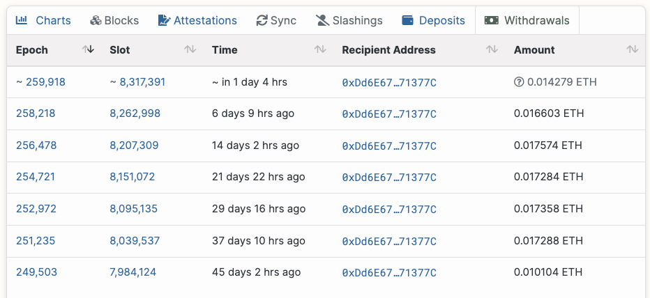

# Stakehouse ETL Data Monitoring and Observability Platform

The Stakehouse ETL is the back-end that has powered `Goerli` and `Mainnet` Ethereum monitoring of validators registered with the Stakehouse and LSD Protocol (LSD Networks are built on top of Stakehouse protocol). More information on those protocols can be found here:

https://docs.joinstakehouse.com/monitoring/Stakehouse-Monitoring-Overview


The extract, transform, load AWS pipeline offered here is uniquely positioned to extract proposer data simulataneously from the Ethereum consensus layer as well as the execution layer (Stakehouse protocol) for internal and external analytics applications. This is the first tool of its kind and ahead of its time for the Ethereum consensus layer.

The official source on contract information for the Stakehouse protocol can be found here:

https://github.com/stakehouse-dev/contract-deployments

## AWS Python Pipeline

One click deployment to AWS is offered thanks to `serverless`.

Serverless will deploy a python pipeline as captured below


As can be expected from a service that extracts data for storage and transformation, a database is required. MySQL database type is supported out of the box. 

The rest of the wiring of the Stakehouse ETL will involve connecting to the Stakehouse protocol as well as the LSD smart contracts utilising tools such as the Subgraph protocol.

## Running the deployer

You can manually run deployment script for specific environment.

For Mainnet:
```
pip uninstall -r requirements-dev.txt -y
yarn add serverless@3.21.0
node_modules/serverless/bin/serverless.js deploy --verbose --stage mainnet
```

Alternatively, Github or alternative CI can be used to trigger the deployment and upgrade of the ETL upon merging a PR or according to whatever rules you are defining.

Take a look at the `test_and_deploy_mainnet.yaml` file within the `.github` folder.

## Customizing the extraction pipeline

Out of the box, the Stakehouse ETL will provide monitoring and analytics for `all` Stakehouse protocol validators and all LSD networks.

Below we will add instructions on how to rescrict the scraping to your own LSD network so that you can reduce the laod on your database and infrastructure. Please note that the newer your validators and or LSD network, the quicker it will be to spin up the ETL infrastructure from scratch.

### Customizing for your own LSD network

Given that the Stakehouse ETL is designed to extract and curate data for the Stakehouse protocol, inherently it is syncing data about a subset of all active validators on the Ethereum consensus layers from information on the Stakehouse protocol and LSD smart contracts that are on the execution layer. To make enumeration of Stakehouse protocol validators faster, the Subgraph protocol is used.

Subgraph queries can be found in 
```
src/utils/subgraph.py
```

`validator_lsd` is a function that fetches the savETH index associated with a set of BLS public keys in LSD networks. 

Queries like this can be adjusted to filter for validatos of a specific LSD network. For example:
```graphql
lsdvalidators(where: {
    liquidStakingManager: "0x12670b896176c37913e62297e059ec5a00d5a171"
  }, first: 1000) {
    id
  }
```

This is a query that would only fetch validators for the `DREAM` LSD network. If you needed to find out what the liquid staking manager address is of your LSD network, you would run the following query:
```graphql
liquidStakingNetworks(where: {
    ticker: "DREAM"
  }) {
    liquidStakingManager
  }
```

# Troubleshooting

## Missing data

Missing data or gaps in consensus layer data may cause some earnings APIs to fail. 

In these instances, using a backfilling script to plug the data gaps can restore operation to the API. A number of back filling scripts are provided with the repository and instructions on how to use the scrips accompany them.

It is worth making a note about how situations like this can arise. Often it's down to two reasons:
- The associated archive node experienced a prolonged outage enough for messages in the queue to hit the dead letter queues
- Changes were made to the pipeline which meant that one of the extract, transform, load stages were interfered with and that lead to the failure of data storage that requires back filling

Once the issue is identified and fixed, it is then required to back fill and catch up with the head of the finalized part of the chain. Additionally, it is worth considering using either an external node runner with sufficient bandwidth and archive capabilities or alternatively running back-up nodes for redundancy served by a load balancer.

Included in the documentation are instructions on how to set up your archive node. For best performance and results, archiving data in chunks of 32 slots (1 epoch) is the best but that will come with large storage requirements. It will aid back-filling to make that faster when required.

If you are running your own nodes, you can consult documentation regarding the consensus layer configuration. For example, here is Lighthouse: https://lighthouse-book.sigmaprime.io/advanced_database.html

In the lighthouse documentation, they refer to specifying a CLI flag `--slots-per-restore-point` with smaller values allowing for faster lookup of historical state.

It would be possible to build snapshotting into the product to allow for quick restoration in the event of a tear down or corruption scenario which would otherwise require scraping data from scratch.

## Backfiller for income

Take a look at the [`back-fillers`](./back-fillers/) folder. The core income backfiller can be run as a python script:

```
python3 backfiller.py
```

Which takes as an input an `epoch` to fill from as defined in the `epoch.text` file.

The back filler will:
- Fetch the list of BLS public keys eligible for scraping
- Check the last known epochs where income was recorded
- Check what needs to be back filled

It is important to update configuration in the `utils/` folder. In particular:

`data_utils.py` where, the following needs to be updated:
```
SQL_ENDPOINT = ""
USER = ''
PASS = ''
```

`archive.py` which is the archive node configured for the ETL.

## Backfilling withdrawals
Checking whether the ETL is keeping track with all of the sweeps from the consensus layer, one can run the following script:

```
scripts/check-sweeps.js
```

Once the dependencies are installed and the script is run, the following is an example output:
```
[
  {
    "validatorIndex": "1071486",
    "blsKey": "0xb5291d731d9fbfdbbcff27f88f14914f2a143f375d27c0977a2684e8c708c151a0c2976964455ba6cdb0d749b38361c8",
    "depositor": "0x3c909a88ad8c4d2ef56e41667abd4e0b31e38b4f",
    "knotMetadata": {
      "isPartOfIndex": false,
      "savETHIndexId": "0"
    },
    "sweeps": {
      "sweeps": [
        {
          "slot": 7984124,
          "amount": 10104074,
          "withdrawal_index": 28091986
        },
        {
          "slot": 8039537,
          "amount": 17288577,
          "withdrawal_index": 28969310
        },
        {
          "slot": 8095135,
          "amount": 17358011,
          "withdrawal_index": 29848726
        },
        {
          "slot": 8151072,
          "amount": 17284942,
          "withdrawal_index": 30732202
        },
        {
          "slot": 8207309,
          "amount": 17574289,
          "withdrawal_index": 31623973
        },
        {
          "slot": 8262998,
          "amount": 16603923,
          "withdrawal_index": 32507245
        }
      ],
      "sumOfSweeps": "96213816"
    },
    "beaconAPIRewards": 110443017
  }
]
```

The sweeps array is what ETL has scraped, and this can be compared against the beacon chain. For example:
```
https://beaconcha.in/validator/1071486#withdrawals
```
